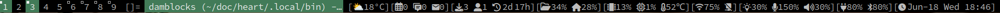

#  damblocks
My *Simple bar* script for displaying status information in [river](https://codeberg.org/river/river) and [dwl](https://codeberg.org/dwl/dwl).




Fork of [sbar](https://github.com/pystardust/sbar). Written in POSIX SHELL.

## Features
* Modules update with variable timing.
* Signalling to update modules when needed.
- Output to stdin(default) or a fifo(with --fifo option, at `XDG_RUNTIME_DIR/damblocks.fifo`).

## Dependency
**depends:**    ttf-nerd-fonts-symbols wireplumber brightnessctl coreutils sed grep awk curl cronie stow systemd

**suggests:**   dash bluez-utils isync newsboat calcurse mpc wob

Every function that supports signaling depends on one or more of:
  1. [scripts](./bin/)
  2. [udev rules](etc/udev/rules.d/)
  3. [cronjobs](./etc/crontab)

Specific dependencies are listed in the SIGNALING session in this script.

## Installation
To mange all the scripts, udev rules and cronjobs:
```sh
# no sudo, scripts and cronjobs are installed as current user instead of root
# install
make install
# uninstall
make uninstall
```

## Usage
### river with kwm
Add below in  `~/.config/river/init`
```sh
# my build of kwm
# https://codeberg.org/unixchad/kwm
# https://github.com/gnuunixchad/kwm
${HOME}/.local/bin/damblocks --fifo &
killall -q mpc
${HOME}/.local/bin/damblocks-mpdd
```

And run
```sh
exec ssh-agent river --no-xwayland
```

To restart the bar script
```sh
nohup damblocks --fifo >/dev/null 2>&1 &
```
---

### river-classic with dam
Add below in  `~/.config/river/init`
```sh
# my build of dam
# https://codeberg.org/unixchad/dam
# https://github.com/gnuunixchad/dam
riverctl spawn "${HOME}/.local/bin/dam-run"
```
([dam-run](./dam-run))

And run
```sh
exec ssh-agent river --no-xwayland
```
---

### dwl with bar patch
```sh
# my build of dwl
# https://codeberg.org/unixchad/dwl
# https://github.com/gnuunixchad/dwl
alias dl="exec ssh-agent ${HOME}/.local/bin/damblocks | /usr/local/bin/dwl"
```

## Modification

* Add bar module as a function. Make sure to assign it to a variable.
```
update_cpu () { 
	cpu="$( grep -o "^[^ ]*" /proc/loadavg )" 
}
```

* Modify display function to change the positioning of output.
``` display () { 
	xsetroot -name " [$weather] [$memory $cpu] [$bat] [$backlight] [$vol] $time "
}
```
You can use printf instead of xsetroot to feed it into some other bar like lemonbar.

* If signalling needed then add
```
trap "update_cpu;display" "RTMIN+6"
```
* this will update cpu when signal 40=34+6 is given to the script (RTMIN = 34)
* to update it from external commands
```
kill -40 "$(cat ~/.cache/pidofbar)"
```
* Example from my sxhkrc
```
{XF86AudioRaiseVolume,XF86AudioLowerVolume}
	pulsemixer --change-volume {+,-}5 ; \
	kill -34 "$(cat ~/.cache/pidofbar)"
```


* Add the update information in the while loops as follows
``` [ $((sec % 60)) -eq 2 ] && update_cpu
```
To update item ever 60 seconds with an offset of 2 seconds.
